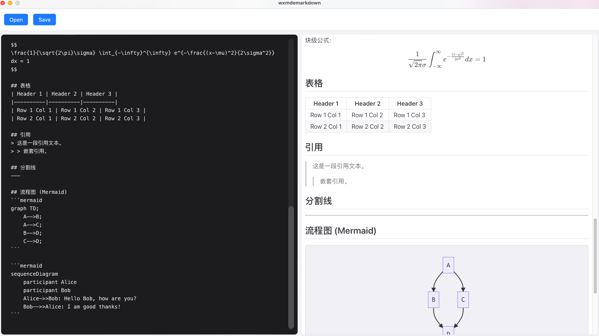

# wxmdemarkdown

A modern, fast, and cross-platform Markdown editor built with **Wails** and **React**.



## Features

- **Real-time Preview**: See your changes instantly as you type.
- **Rich Markdown Support**:
  - **GFM**: GitHub Flavored Markdown support.
  - **Math**: Mathematical equations rendering using KaTeX ($E=mc^2$).
  - **Diagrams**: Integrated Mermaid.js support for flowcharts, sequence diagrams, and more.
  - **Code Highlighting**: Syntax highlighting for code blocks.
- **Dark Mode Editor**: A comfortable dark-themed editor pane for focused writing.
- **Cross-Platform**: Runs natively on macOS, Windows, and Linux.

## Tech Stack

- **Backend**: Go (Wails framework)
- **Frontend**: React, TypeScript, Vite
- **Styling**: CSS (Apple-inspired aesthetic)

## Getting Started

### Prerequisites

- [Go](https://go.dev/) (1.18+)
- [Node.js](https://nodejs.org/) (npm)
- [Wails](https://wails.io/) CLI

### Installation

1.  Clone the repository:
    ```bash
    git clone https://github.com/wooship/wxmdemarkdown.git
    cd wxmdemarkdown
    ```

2.  Install frontend dependencies:
    ```bash
    cd frontend
    npm install
    ```

### Running in Development

To run the application in development mode with hot reload:

```bash
wails dev
```

### Building for Production

To build the application for your OS:

```bash
wails build
```

The compiled binary will be located in the `build/bin` directory.

## Usage

1.  **Open**: Click the "Open" button to load an existing Markdown file.
2.  **Edit**: Write your Markdown in the left dark pane.
3.  **Preview**: View the rendered result in the right light pane.
4.  **Save**: Click "Save" to save your changes to a file.

## License

[MIT](LICENSE)
