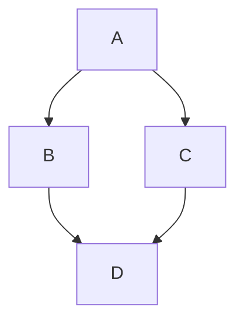
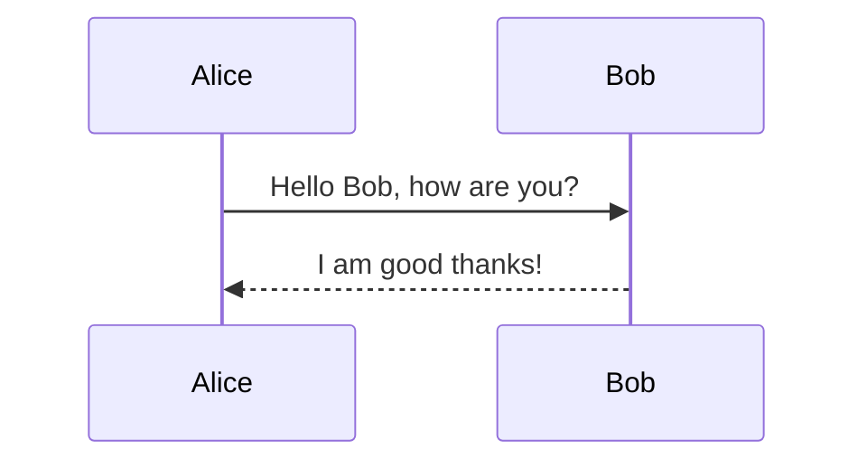

# 欢迎使用 wxm的markdown预览工具!

这是一个用 Go 和 Wails 构建的实时 Markdown 预览工具。

## 文本格式
**粗体**，*斜体*，~~删除线~~，***粗斜体***。

## 列表
### 无序列表
*   项目 A
*   项目 B
    *   子项目 B.1
    *   子项目 B.2
### 有序列表
1.  第一项
2.  第二项
    1.  子项 2.1
    2.  子项 2.2
### 任务列表
- [x] 完成任务 1
- [ ] 未完成任务 2

## 链接与图片
[我的其他工具](https://chatbot.wxwxwxwx.top)


## 代码块
```go
package main

import "fmt"

func main() {
    fmt.Println("Hello, GoMarkLive!")
}
```

```javascript
function greet(name) {
    console.log(`Hello, ${name}!`);
}
greet("World");
```

## 数学公式 (KaTeX)
行内公式: $\int_{-\infty}^{\infty} e^{-x^2} dx = \sqrt{\pi}$

块级公式:
$$
\frac{1}{\sqrt{2\pi}\sigma} \int_{-\infty}^{\infty} e^{-\frac{(x-\mu)^2}{2\sigma^2}} dx = 1
$$

## 表格
| Header 1 | Header 2 | Header 3 |
|----------|----------|----------|
| Row 1 Col 1 | Row 1 Col 2 | Row 1 Col 3 |
| Row 2 Col 1 | Row 2 Col 2 | Row 2 Col 3 |

## 引用
> 这是一段引用文本。
> > 嵌套引用。

## 分割线
---

## 流程图 (Mermaid)



